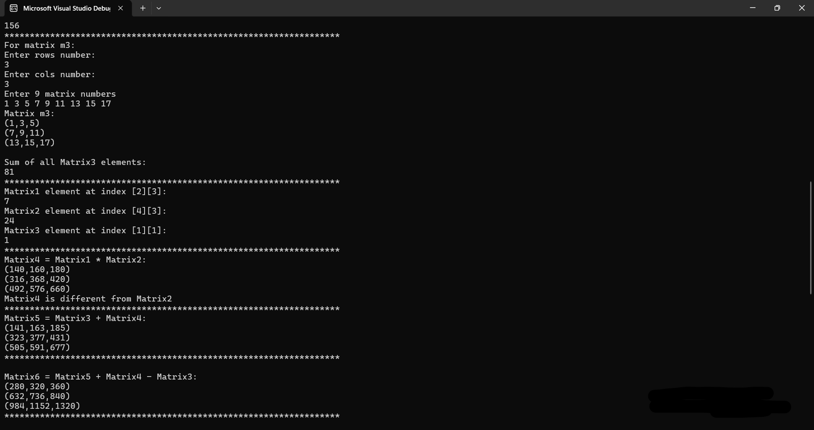
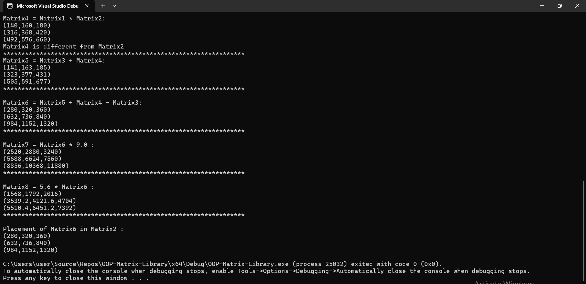

# OOP-Matrix-Library

A professional C++ library for 2D Matrix manipulation, developed using Object-Oriented Programming (OOP) principles. This project focuses on mathematical accuracy, memory safety, and intuitive user interaction through operator overloading.

## Key Features
* Operator Overloading: Implements natural mathematical syntax for matrices, including arithmetic (+, -, *), comparison (==), and I/O streams (<<, >>).
* Defensive Programming: Uses Exception Handling (throw) to detect and report errors like invalid dimensions or index out-of-bounds, preventing system crashes.
* Deep Copy & Memory Management: Adheres to the "Rule of Three" to manage dynamic 2D arrays (double**) correctly, ensuring no memory leaks during object assignment or destruction.
* Functional Casting: A custom casting operator that allows converting a MyMatrix object directly to a double (returning the sum of all elements).

## Mathematical Implementation
The library follows standard linear algebra rules. For example, Matrix Multiplication is implemented as:

$$C_{i,j} = \sum_{k=1}^{n} A_{i,k} \cdot B_{k,j}$$

## Example Usage
The library allows for clean and readable code. Here is a sample demonstrating how the system handles matrix operations:

```cpp
#include "MyMatrix.h"
#include <iostream>

void main() {
    try {
        MyMatrix A(3, 3);
        MyMatrix B(3, 3);
        
        std::cout << "Enter values for Matrix A:" << std::endl;
        std::cin >> A; // Uses overloaded >> operator

        MyMatrix C = A + B;   // Uses overloaded + operator
        MyMatrix D = A * 2.0; // Scalar multiplication
        
        std::cout << "Result Matrix C:\n" << C;
        std::cout << "Total Sum of A elements: " << (double)A << std::endl;
    } 
    catch (const char* error) {
        std::cerr << "Runtime Error: " << error << std::endl;
    }
}
```
## Execution Screenshots
The following screenshots demonstrate the library's core mathematical logic and its robust error handling:

1. **Matrix Arithmetic & Logical Comparisons**


2. **Error Handling & Scalar Operations**


